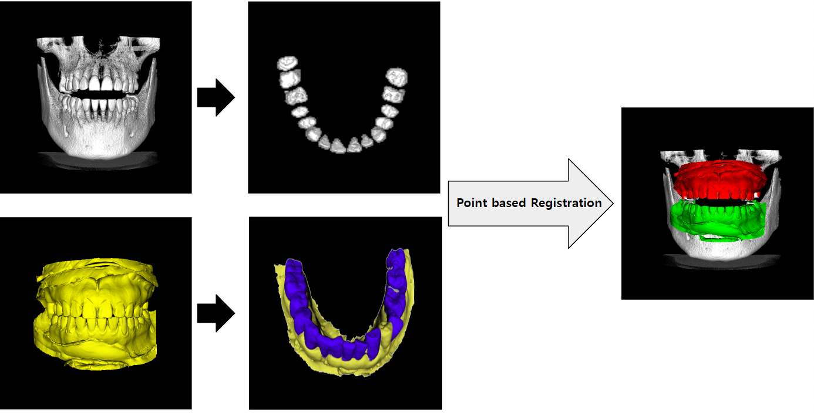
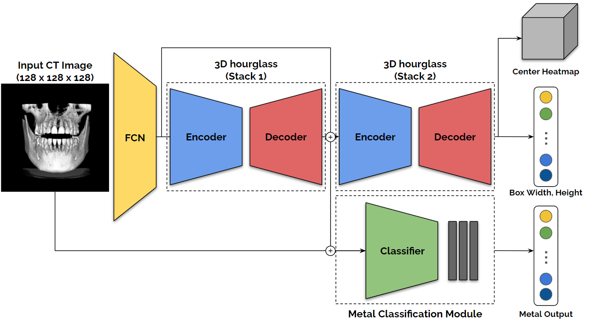

# CBCT-Dental Scan Registration via Metal-Robust CT Segmentation

Implementation of "CBCT-Dental Scan Registration via Metal-Robust CT Segmentation"

## Overall Process


## Framework



## Prerequisites
- [Python 3.6.6](https://www.python.org/)
- [Pytorch 1.9.1](https://pytorch.org/get-started/locally/)


## Installation
The required packages are located in `requirements.txt`.
```
pip install torch==1.9.1+cu111 torchvision==0.10.1+cu111 torchaudio==0.9.1 -f https://download.pytorch.org/whl/torch_stable.html

pip install -r requirements.txt
```


## Training 
To train our detection baseline, follow below train instruction.

```
python train/train_0_detection.py 
python train/train_1_detection_and_metal_classification.py 
```

## Testing
To test the performance of our method, place the given pretrained weight inside of `checkpoints/detection_best_model.pth`.
To test the performance of our method, place the given pretrained weight inside of `checkpoints/detection_and_metal_classification_best_model.pth`.

```
python test/test_0_detection.py
python test/test_1_detection_and_metal_classification.py
```
